# Loan Approval Prediction
# Logistic Regression vs Neural Network | R


#  Overview

Built a binary classification system to predict loan approval outcomes based on applicant financial and demographic data. Compared **Logistic Regression** (interpretable baseline) against a **Neural Network** (MLP) using ROC-AUC and confusion matrix evaluation.

#  Dataset

| Detail | Value |
|---|---|
| Source | Kaggle — Loan Approval Prediction Dataset |
| Records | 4,269 applications |
| Features | 13 (+ 2 engineered) |
| Approval Rate | 61.12% |
| Train / Test Split | 75% / 25% |

**Engineered Features:**
- `total_assets` = sum of all 4 asset values
- `loan_to_income` = loan amount ÷ annual income

#  Exploratory Data Analysis

<table>
  <tr>
    <td>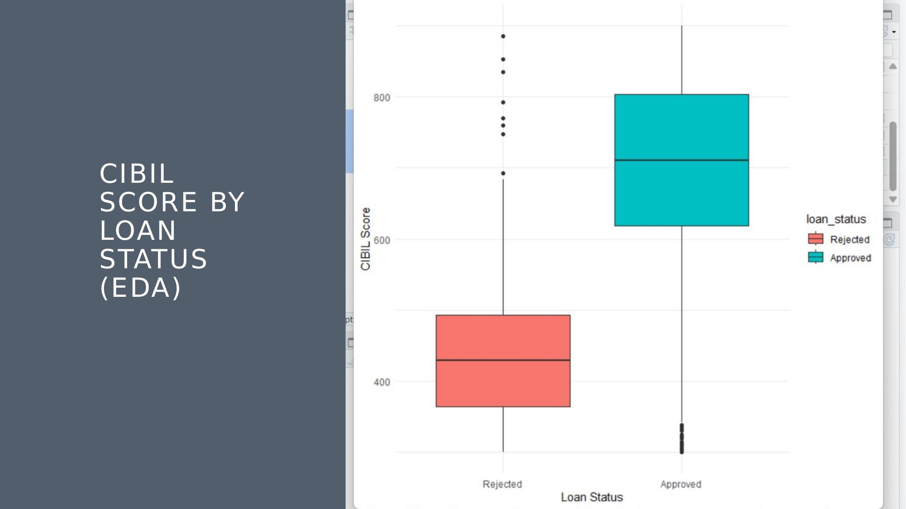<br><sub>CIBIL Score by Loan Status</sub></td>
    <td>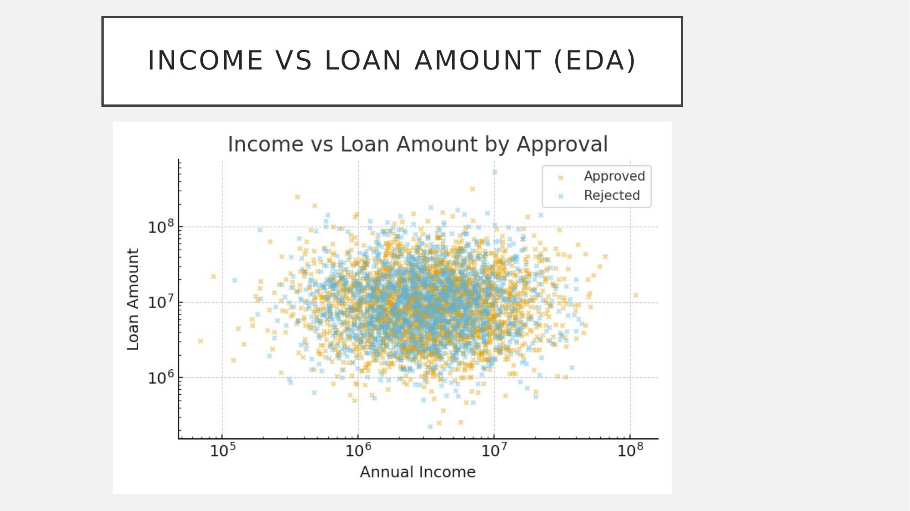<br><sub>Income vs Loan Amount</sub></td>
  </tr>
  <tr>
    <td>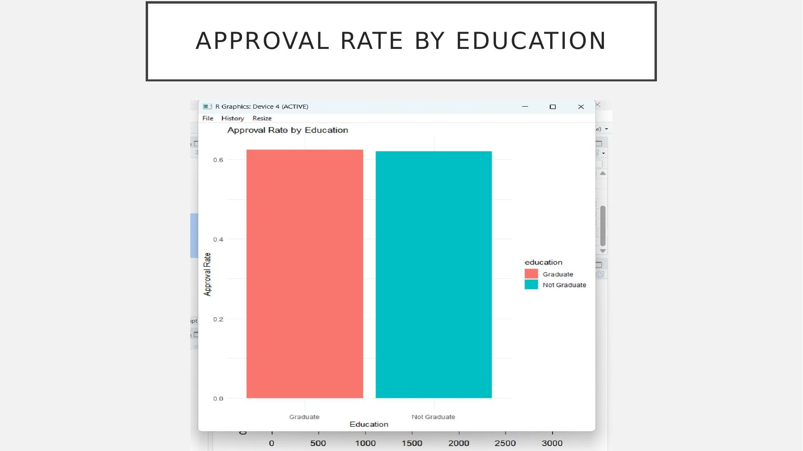<br><sub>Approval Rate by Education</sub></td>
    <td>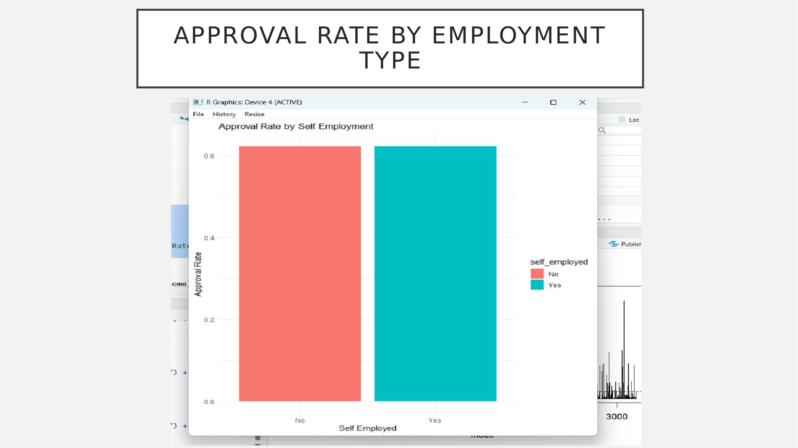<br><sub>Approval Rate by Employment Type</sub></td>
  </tr>
</table>

**Correlation Matrix**

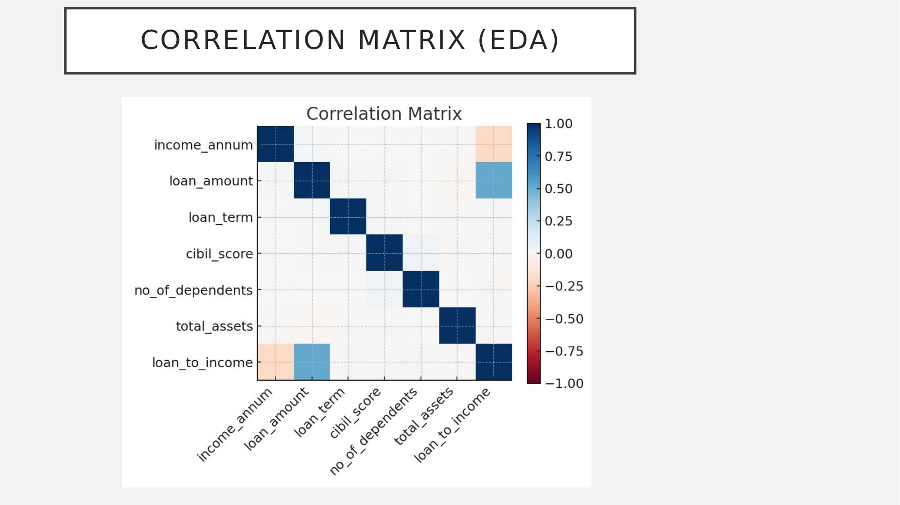


#  Models Built

# 1. Logistic Regression
- Binary classification with binomial family
- VIF test for multicollinearity
- Hosmer-Lemeshow goodness-of-fit test
- Cook's Distance for outlier detection
- Odds ratio interpretation for business explainability

# 2. Neural Network (MLP)
- 3 hidden nodes
- Trained on 6 key numerical features
- Compared against logistic regression via ROC curve

# Results
# Logistic Regression
<table>
  <tr>
    <td>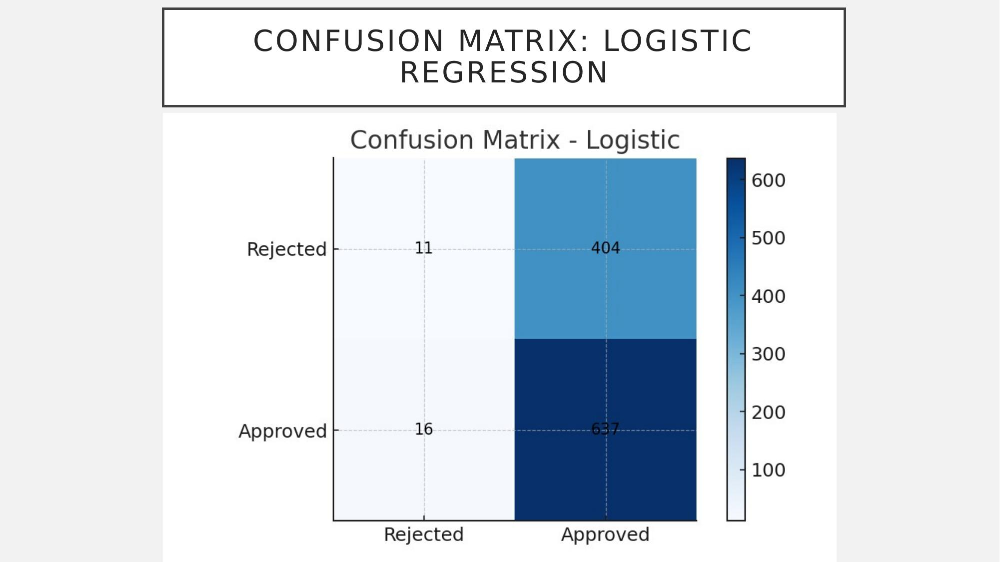<br><sub>Confusion Matrix</sub></td>
    <td>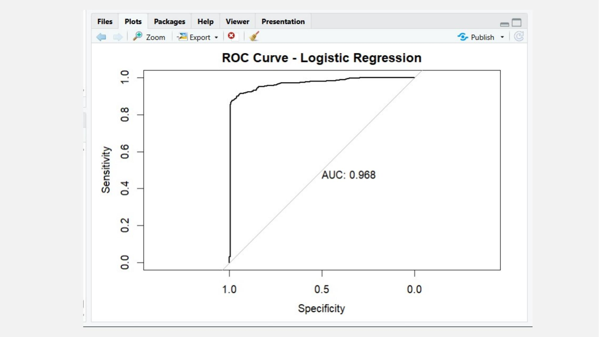<br><sub>ROC Curve</sub></td>
  </tr>
</table>

# Neural Network
<table>
  <tr>
    <td>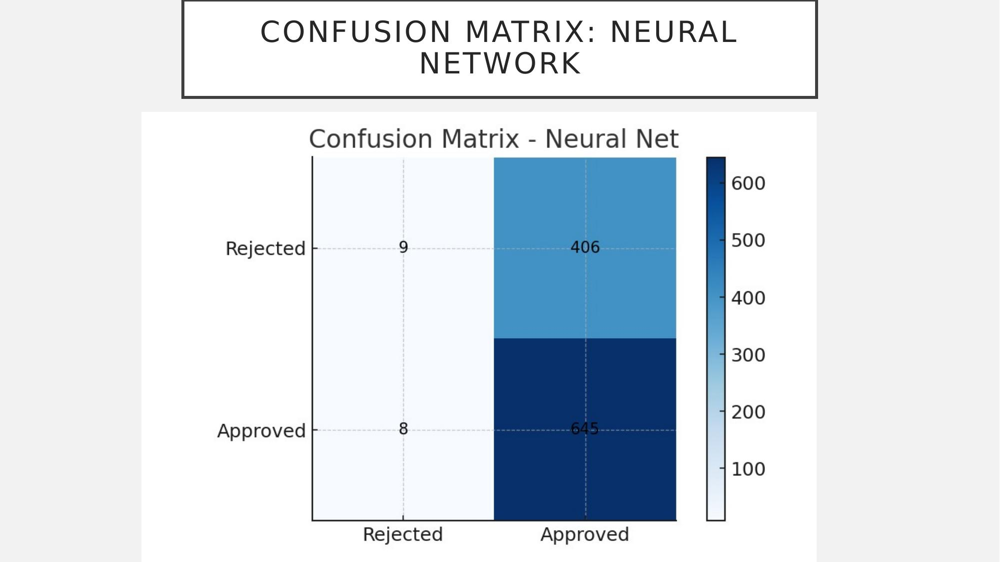<br><sub>Confusion Matrix</sub></td>
    <td>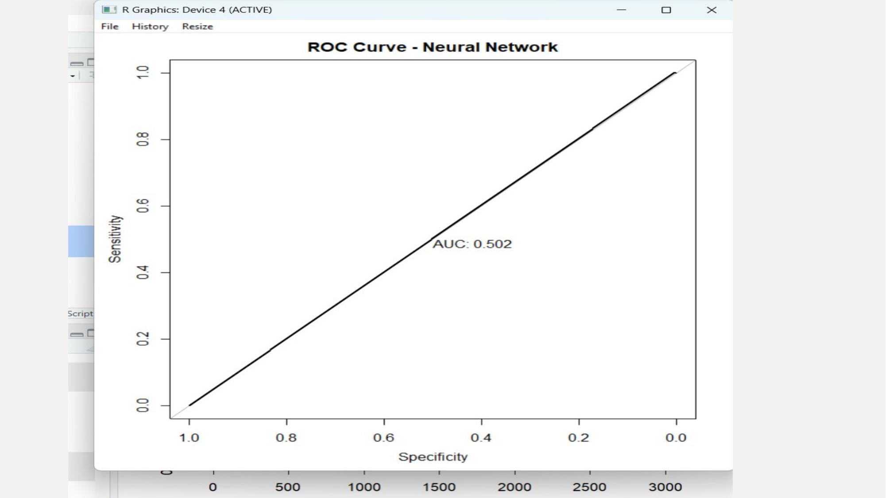<br><sub>ROC Curve</sub></td>
  </tr>
</table>

# ROC Comparison
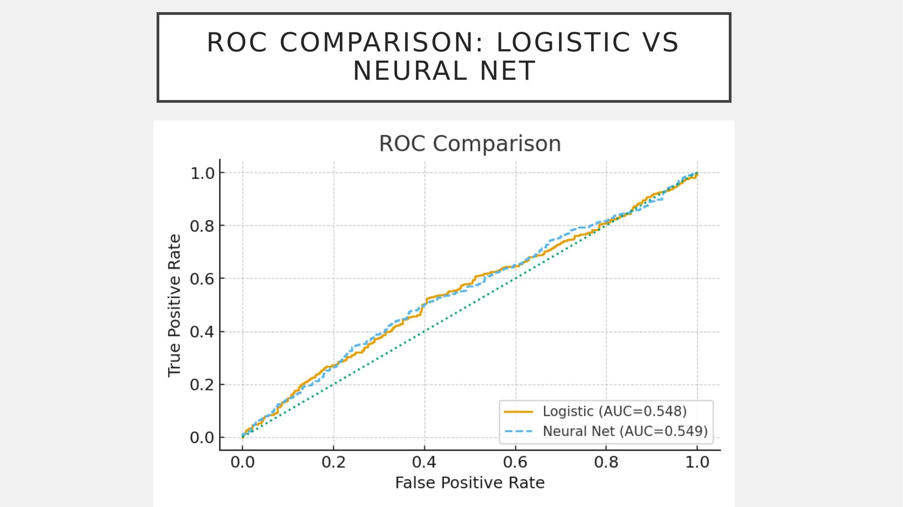

#  Model Performance

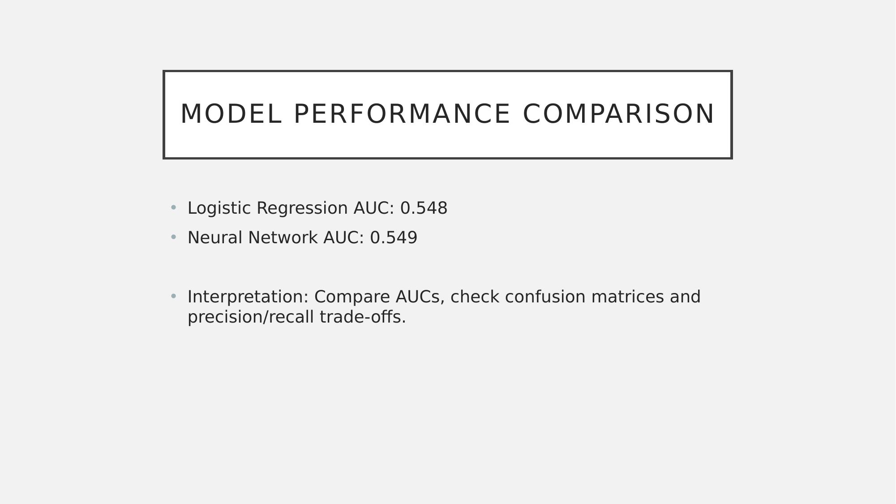

| Model | AUC Score | Preferred? |
|---|---|---|
| Logistic Regression | 0.548 | Yes |
| Neural Network | 0.549 | No |

> Logistic Regression is preferred — nearly identical performance with far better interpretability for banking contexts.

#  Key Findings

- **CIBIL score** is the strongest predictor of loan approval
- **Self-employed applicants** have lower approval odds than salaried
- **High loan-to-income ratio** significantly reduces approval probability
- **Graduate applicants** show higher approval rates
- Neural Network adds complexity without meaningful accuracy gain

#  How to Run

```r
# Install packages (first time only)
install.packages(c("readr", "dplyr", "ggplot2", "reshape2",
                   "caret", "car", "pROC", "ResourceSelection",
                   "neuralnet", "scales"))

# Run the script
source("loan_approval.R")
```
#  Repository Structure
```
loan-approval-prediction/
├── loan_approval.R               # R script
├── loan_approval_dataset.csv     # Dataset
├── images/                       # Result visualizations
└── README.md
```
#  Tech Stack
`R` `ggplot2` `caret` `pROC` `neuralnet` `car` `ResourceSelection`
